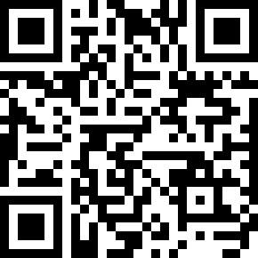

<p align="center">
  
</p>

<h1 align="center">🔲 QRForge</h1>

<p align="center">
  <strong>A lightweight QR code generator written in pure C</strong><br>
  Encodes any text into a scannable QR code PNG — no dependencies, no bloat.
</p>

<p align="center">
  
  
  
</p>

---

## 📖 About

**QRForge** is a command-line QR code generator that takes any UTF-8 text input and produces a clean, scannable PNG image. Built on top of two excellent C libraries by [Project Nayuki](https://www.nayuki.io/):

- **[QR Code Generator](https://github.com/nayuki/QR-Code-generator)** — Handles the QR encoding logic (versions 1–40, all ECC levels)
- **[Tiny PNG Output](https://www.nayuki.io/page/tiny-png-output)** — Writes raw pixel data to valid PNG files (no libpng/zlib needed)

The result is a **self-contained, zero-dependency** tool that compiles with a single `gcc` command.

---

## ⚡ Quick Start

### Build

```bash
gcc -Wall -Wextra -g -std=c11 -o qr qr.c qrcodegen.c TinyPngOut.c
```

Or with Make:

```bash
make
```

### Run

```bash
# Encode plain text
echo -n "Hello, World!" | ./qr

# Encode a URL
echo -n "https://github.com" | ./qr

# Encode WiFi credentials
echo -n "WIFI:S:MyNetwork;T:WPA;P:password123;;" | ./qr
```

The QR code is written to **`out.png`** in the current directory.

---

## 🛠️ How It Works

```
stdin (text) ──▶ qrcodegen (encode) ──▶ TinyPngOut (render) ──▶ out.png
```

1. **Read** — Text is read from standard input via `fgets()`
2. **Encode** — The `qrcodegen` library encodes the text into a QR code data structure, automatically selecting the optimal version (size) and mask pattern
3. **Scale** — Each QR module (cell) is scaled up by **10×** to produce a clear, scannable image
4. **Write** — The `TinyPngOut` library writes the black/white pixel data as a valid PNG file

---

## ⚙️ Configuration

These constants in `qr.c` can be adjusted:

| Constant | Default | Description |
|----------|---------|-------------|
| `SCALE` | `10` | Pixel multiplier per QR module. Higher = larger image |
| `QR_MAX_INPUT_LENGTH` | `2953` | Max input bytes (QR standard hard limit) |

The ECC level is set to `LOW` with auto-boosting enabled — the library will automatically increase error correction if the data fits.

---

## 📁 Project Structure

```
QRForge/
├── qr.c             # Main program — glues everything together
├── qrcodegen.c      # QR Code generation library (Project Nayuki)
├── qrcodegen.h      # QR Code generation header
├── TinyPngOut.c     # PNG output library (Project Nayuki)
├── TinyPngOut.h     # PNG output header
├── Makefile         # Build configuration
├── sample_qr.png   # Sample QR code output
└── .gitignore
```

---

## 🔍 What Can It Encode?

Anything that fits in a QR code! Some common use cases:

| Type | Example Input |
|------|---------------|
| **Plain text** | `Hello, World!` |
| **URLs** | `https://github.com` |
| **WiFi** | `WIFI:S:NetworkName;T:WPA;P:password;;` |
| **Email** | `mailto:user@example.com` |
| **Phone** | `tel:+1234567890` |
| **vCard** | `BEGIN:VCARD\nFN:John Doe\nTEL:+1234567890\nEND:VCARD` |

The QR standard supports up to **2,953 bytes** of UTF-8 text (version 40, low ECC).

---

## 📜 License

| Component | License |
|-----------|---------|
| `qr.c`, `Makefile` | MIT |
| `qrcodegen.c` / `.h` | MIT ([Project Nayuki](https://github.com/nayuki/QR-Code-generator)) |
| `TinyPngOut.c` / `.h` | LGPLv3+ ([Project Nayuki](https://www.nayuki.io/page/tiny-png-output)) |

---

## 🙏 Acknowledgements

Built on the shoulders of **[Project Nayuki](https://www.nayuki.io/)** — outstanding C libraries with thousands of GitHub stars. This project simply glues them together into a useful command-line tool.
